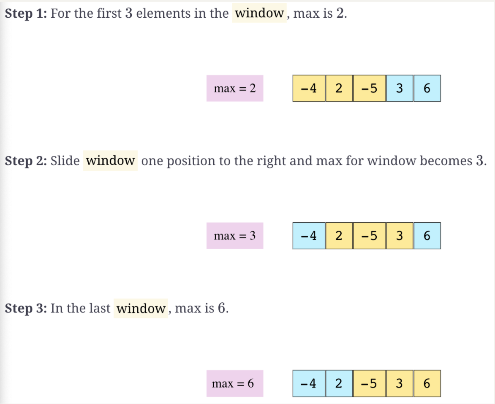

# CodeProblemsNote

[TOC]

### Two Sum

Problem:
>Given an array of integers, return indices of the two numbers such that they add up to a specific target.   
>Each input have exactly one solution, and you may not use the same element twice


Example:
>Given nums = [2, 7, 11, 15], target = 9,
>     
>Because nums[0] + nums[1] = 2 + 7 = 9,       
>return [0, 1].

思路：      
>Iterate the array and use HashMap to store each element. Specifically, store each value in the array as the key and store its index as the value into the HashMap.
Since to put an item into the HashMap takes O(1) time, and to check if the HashMap contains a specific value also takes O(1) time. The whole process will take O(n) time.


Algorithm:
>Iterate through the array, for each element, check if its "complementary number" ( the number add up to the target) is already in the HashMap. If it is true, the result is found. Otherwise, put the  index of the element in the array using the value of the element as key.

Java Code:

```java
public int[] twoSum(int[] nums, int target) {
	Map<Integer, Integer> theMap = new HashMap<>();
	for( int i = 0; i < nums.length; i++) {
 		if (theMap.containsKey( target - nums[i] )) {
 			int[] result = {theMap.get(target-nums[i], i};
 			return result;
 		}
 	}
 	return null;
}
```
Thoughts:

>Why use the index of the element as value, the value of the element as key when putting it into the HashMap, instead of the other way?
The key of this algorithm is:
>1. Use HashMap.containsKey() to check if it contains the complementary number.
>2. Use HashMap.get() to get the index of the complementary number
>
>If we store the data in the other way. The first step could be replaced using HashMap.containsValue(), which is fine. However, the second part would be a problem since there is no HashMap.getValue(), or at least there is no efficient way to implement HashMap.containsValue(). The efficiency of hashMap comes from the hush function which works on the key instead of the value.


### Add Two Numbers
Problem:
> You are Given two non-empty linked lists representing two non-negative integer. The digits are stored in revere order and each node contains a single digit. Add the two numbers and return it as a linked list.

Example:
>Input: (2 -> 4 -> 3) + (5 -> 6 -> 4)
 Output: 7 -> 0 -> 8
 Explanation: 342 + 465 = 807.

思路:
> Simply sum two numbers digit by digit starting from the least-significant digit, which is the heads of the linked lists. For each addition on two digits, if the summation exceed 10, for example the summation is 12,1 will be carried to the more significant digit and the current digit will be set to 2. Just as you do the kindergarten math.

Java Code:
```java
public ListNode addTwoNumbers(ListNode l1, ListNode l2) {
	ListNode head = new ListNode(0);
	ListNode list1 = l1, list2 = l2, currNode = head;
	int carry = 0;

	while (list1 != null || list2 != null) {
		int x = (list1 != null) ? list1.val : 0;
		int y = (list2 != null) ? list2.val : 0;
		int sum = x + y + carry;
		carry = sum / 10;
		int digit = sum % 10;
		currNode.next = new ListNode(digit);
		currNode = currNode.next;
		if (list1 != null) list1 = list1.next;
		if (list2 != null) list2 = list2.next;
	}
	if (carry > 0) {
		currNode.next = new ListNode(carry);
	}
	return head.next;
}
```


### Longest Substring Without Repeating Characters.

Problem:
> Given a string, find the length of the longest substring without repeating characters

#### Solution 1:
思路：
> Initialize a HashSet to store the characters.
Use a sliding window[```i```, ```j```] to representing the substring between index ```i``` and index ```j```(inclusively).
Set ```i```, ```j``` and ```ans``` to 0
Iterate through the string and for each character in the string:
>> if the character is found in the HashSet:
>>> remove character at index ```i``` from the HashSet
>>> ```i``` = ```i``` + 1
>>
>> else:
>>>add the characters to the HashSet
>>> ```j``` = ```j``` + 1
>>>set ```ans``` to max(```ans```, ```j```-```i```);

>return ```ans```

Java Code:
```java
public int lengthOfLongestSubstring(String s) {
        Set<Character> chars = new HashSet<>();
        int i = 0, j = 0, ans = 0;
        int length = s.length();
        while (j < length){
            if (chars.contains(s.charAt(j))){
                chars.remove(s.charAt(i));
                i++;
            } else {
                chars.add(s.charAt(j));
                j ++;
                ans = Math.max(ans, j-i);
            }
        }
        return ans;
    }
```

Complexity Analysis:
> In the worst case, that is, all characters in the string are the same, both the "if" condition and "else" condition will run n times(n = length of string). So the whole while loop will run 2n times.
So the time complexity = O(2n) = O(n)
>
> In the worst case, that is, all characters in the string are unique, every characters in the string will be added to the HashSet. So the length of the string n will be a upper bound for space complexity.
If the length of the string is larger than the number of total unique characters of the specific charset, the space complexity will be upper bounded by the number of total unique characters m.
So the space complexity = O(min(n,m))

#### Solution 2
思路
> Optimized from solution 1. Instead of using a HashSet to store the characters in solution 1, use a HashMap to store the characters as key and their index as value. Then when iterating the string, if the characters is found in the HashMap, we can get its index where the character is found and move the ```i``` cursor to the character right after it. This will give a better time complexity than solution 1.

Java Code:
```java
        Map<Character, Integer> chars = new HashMap<>();
        int i = 0,j = 0, ans = 0;
        int length = s.length();
        while (j < length) {
            if (chars.containsKey(s.charAt(j))) {
                i = Math.max(i, chars.get(s.charAt(j))+1);

            }
            chars.put(s.charAt(j),j);
            j++;
            ans = Math.max(ans, j-i);
        }
        return ans;
    }
```

Complexity Analysis
> In the worst case, which is all characters in the string are the same, the while loop will run n times(n = length of string).
So the time complexity = O(n)
> The space complexity is the same as solution 1, O(min(m,n));

### Find index in sorted array

Problem:

>Given a sorted array of integers, return the index of the given key. Return ```-1``` if not found.

思路：

> Use divide and Conquer strategy.
>
> Since the array is sorted, we can start by comparing the search key with the integer at the middle of the array. If the search key is equal to the middle key, we find it and we can return the index of the middle key. Else, if the search key is smaller than the middle key of the array. We search it using the same strategy in the left half of the array. Otherwise, we search it in the right half in the array.

Java Code:

```java
static int binSearch(int[] a, int key) {
    int left = 0, right = a.length-1;
    while (left <= right) {
      int mid = (left + right) / 2;
      if (a[mid] == key) return mid;
      else if (key < a[mid]) right = mid -1;
      else left = mid+1;
    }
    return -1;
  }
```

Complexity Analysis:

> This algorithm uses divide and conquer algorithm. The while loop will runs ```logN``` times. So the time complexity is O(logN)
>
> The space complexity is O(1) since fixed amount of space, specifically, ```left```,```right``` and```mid```, is used.


### Find Maximum in Sliding Window

#### Problem:

> Given a large array of integers and a window of size w, find the current maximum value in the window as the window slides through the array.

#### Example:



#### 思路：

> Use a deque data structure to approach the problem. A Deque is a double head queue, which you could add and remove item from its both end in O(1) time.
>
> The following algorithm will maintain a deque that always has the index of the largest number in the current sliding window at it head.
>
> Iterate through the array, for each iteration, 
>
> 1. first check if the last item stored in the deque is smaller than the current number. Keep removing items from the end of the deque until its last item is larger than the current number. 
>
> 2. Then check if the item at the head of the deque are still in the sliding windows. Remove the item at the head if it is no longer in the sliding windows. 
>
> > (Notice that for each number, there are two possible way to get out of the deque. If the number is the largest number of the previous sliding window, and it is larger than the current number, and it is also at the leftest position of the sliding windows, then it will be removed from the head of the deque since it will no longer be in the sliding window at this iteration. Otherwise, it will be removed from the end of the deque when a number larger than it enters) 
>
> 3. Then add the current number to the end of the deque.

Java Code:

``` java
public static ArrayDeque<Integer> findMaxSlidingWindow(int[] arr, int windowSize) {
    ArrayDeque<Integer> result = new ArrayDeque<>(); 
    ArrayDeque<Integer> window = new ArrayDeque<>();
  
    if (arr.length ==0 || arr.length<windowSize) return result;
    
    for (int i = 0; i < windowSize; i++){
      while (!window.isEmpty() && arr[i] > arr[window.peekLast()]){
        window.removeLast();
      } 
      window.addLast(i);
    }
    result.add(arr[window.peekFirst()]);
    for (int i = windowSize; i < arr.length; i++){
      while (!window.isEmpty() && arr[i] > arr[window.peekLast()]) {
        window.removeLast();
      }
      if (!window.isEmpty() && window.peekFirst() <= i-windowSize){
        window.removeFirst();
      }
      window.addLast(i);
      result.add(arr[window.peekFirst()]);
    }
    return result;
  }
```

#### Complexity Analysis

> The array is iterated once. Each item in the array entered the deque once. So the time complexity is O(n)
>
> The item in the deque will not exceed the size of the sliding windows ```w```, so the memory complexity is O(m)