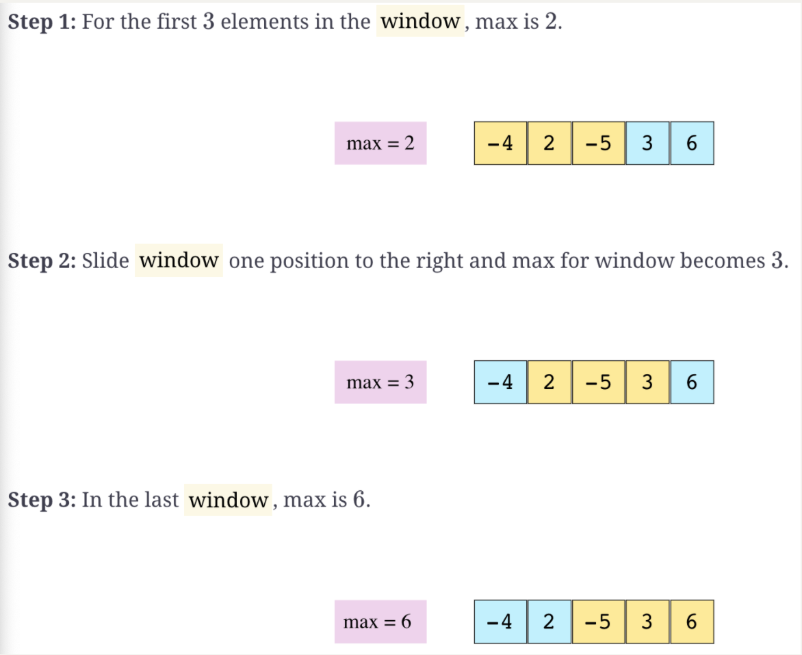
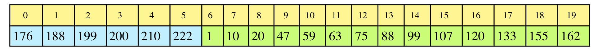
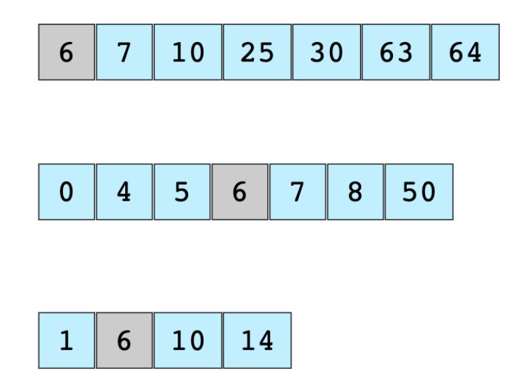
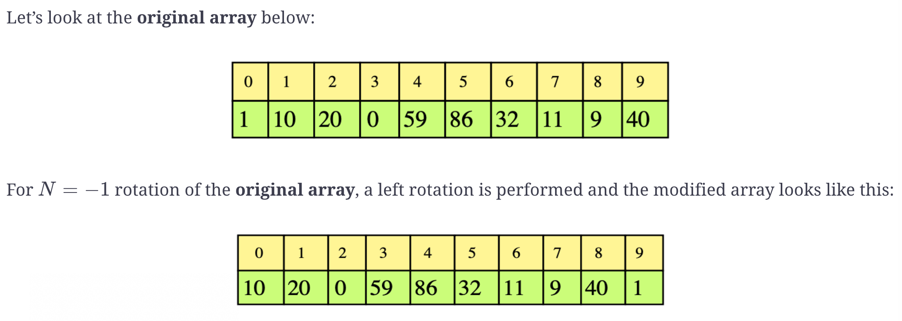
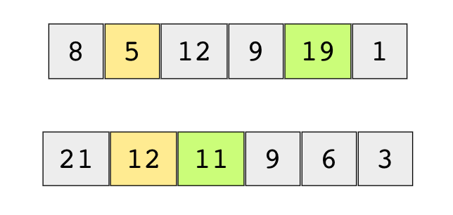
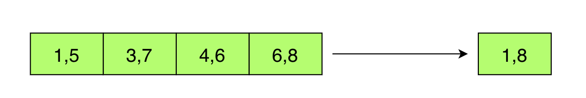
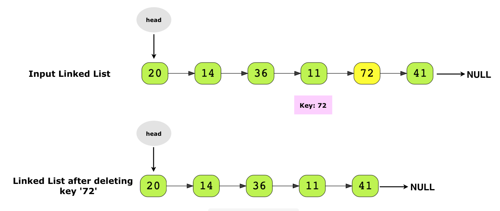
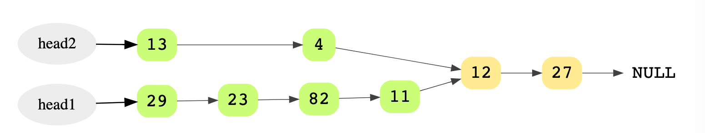

# CodeProblemsNote

[TOC]

## Array

### Two Sum

Problem:
>Given an array of integers, return indices of the two numbers such that they add up to a specific target.
>Each input have exactly one solution, and you may not use the same element twice


Example:
>Given nums = [2, 7, 11, 15], target = 9,
>     
>Because nums[0] + nums[1] = 2 + 7 = 9,       
>return [0, 1].

思路：      
>Iterate the array and use HashMap to store each element. Specifically, store each value in the array as the key and store its index as the value into the HashMap.
Since to put an item into the HashMap takes O(1) time, and to check if the HashMap contains a specific value also takes O(1) time. The whole process will take O(n) time.


Algorithm:
>Iterate through the array, for each element, check if its "complementary number" ( the number add up to the target) is already in the HashMap. If it is true, the result is found. Otherwise, put the  index of the element in the array using the value of the element as key.

Java Code:

```java
public int[] twoSum(int[] nums, int target) {
	Map<Integer, Integer> theMap = new HashMap<>();
	for( int i = 0; i < nums.length; i++) {
 		if (theMap.containsKey( target - nums[i] )) {
 			int[] result = {theMap.get(target-nums[i], i};
 			return result;
 		}
    theMap.put(nums[i],i);
 	}
 	return null;
}
```
Thoughts:

>Why use the index of the element as value, the value of the element as key when putting it into the HashMap, instead of the other way?
The key of this algorithm is:
>1. Use HashMap.containsKey() to check if it contains the complementary number.
>2. Use HashMap.get() to get the index of the complementary number
>
>If we store the data in the other way. The first step could be replaced using HashMap.containsValue(), which is fine. However, the second part would be a problem since there is no HashMap.getValue(), or at least there is no efficient way to implement HashMap.containsValue(). The efficiency of hashMap comes from the hush function which works on the key instead of the value.


### Longest Substring Without Repeating Characters.

Problem:
> Given a string, find the length of the longest substring without repeating characters

#### Solution 1:
思路：
> Initialize a HashSet to store the characters.
Use a sliding window[```i```, ```j```] to representing the substring between index ```i``` and index ```j```(inclusively).
Set ```i```, ```j``` and ```ans``` to 0
Iterate through the string and for each character in the string:
>> if the character is found in the HashSet:
>>> remove character at index ```i``` from the HashSet
>>> ```i``` = ```i``` + 1
>>
>> else:
>>>add the characters to the HashSet
>>> ```j``` = ```j``` + 1
>>>set ```ans``` to max(```ans```, ```j```-```i```);

>return ```ans```

Java Code:
```java
public int lengthOfLongestSubstring(String s) {
        Set<Character> chars = new HashSet<>();
        int i = 0, j = 0, ans = 0;
        int length = s.length();
        while (j < length){
            if (chars.contains(s.charAt(j))){
                chars.remove(s.charAt(i));
                i++;
            } else {
                chars.add(s.charAt(j));
                j ++;
                ans = Math.max(ans, j-i);
            }
        }
        return ans;
    }
```

Complexity Analysis:
> In the worst case, that is, all characters in the string are the same, both the "if" condition and "else" condition will run n times(n = length of string). So the whole while loop will run 2n times.
So the time complexity = O(2n) = O(n)
>
> In the worst case, that is, all characters in the string are unique, every characters in the string will be added to the HashSet. So the length of the string n will be a upper bound for space complexity.
If the length of the string is larger than the number of total unique characters of the specific charset, the space complexity will be upper bounded by the number of total unique characters m.
So the space complexity = O(min(n,m))

#### Solution 2
思路
> Optimized from solution 1. Instead of using a HashSet to store the characters in solution 1, use a HashMap to store the characters as key and their index as value. Then when iterating the string, if the characters is found in the HashMap, we can get its index where the character is found and move the ```i``` cursor to the character right after it. This will give a better time complexity than solution 1.

Java Code:
```java
        Map<Character, Integer> chars = new HashMap<>();
        int i = 0,j = 0, ans = 0;
        int length = s.length();
        while (j < length) {
            if (chars.containsKey(s.charAt(j))) {
                i = Math.max(i, chars.get(s.charAt(j))+1);

            }
            chars.put(s.charAt(j),j);
            j++;
            ans = Math.max(ans, j-i);
        }
        return ans;
    }
```

Complexity Analysis
> In the worst case, which is all characters in the string are the same, the while loop will run n times(n = length of string).
> So the time complexity = O(n)
> The space complexity is the same as solution 1, O(min(m,n));

### Find index in sorted array

Problem:

>Given a sorted array of integers, return the index of the given key. Return ```-1``` if not found.

思路：

> Use divide and Conquer strategy.
>
> Since the array is sorted, we can start by comparing the search key with the integer at the middle of the array. If the search key is equal to the middle key, we find it and we can return the index of the middle key. Else, if the search key is smaller than the middle key of the array. We search it using the same strategy in the left half of the array. Otherwise, we search it in the right half in the array.

Java Code:

```java
static int binSearch(int[] a, int key) {
    int left = 0, right = a.length-1;
    while (left <= right) {
      int mid = (left + right) / 2;
      if (a[mid] == key) return mid;
      else if (key < a[mid]) right = mid -1;
      else left = mid+1;
    }
    return -1;
  }
```

Complexity Analysis:

> This algorithm uses divide and conquer algorithm. The while loop will runs ```logN``` times. So the time complexity is O(logN)
>
> The space complexity is O(1) since fixed amount of space, specifically, ```left```,```right``` and```mid```, is used.


### Find Maximum in Sliding Window

Problem:

> Given a large array of integers and a window of size w, find the current maximum value in the window as the window slides through the array.

Example:



思路：

> Use a deque data structure to approach the problem. A Deque is a double head queue, which you could add and remove item from its both end in O(1) time.
>
> The following algorithm will maintain a deque that always has the index of the largest number in the current sliding window at it head.
>
> Iterate through the array, for each iteration,
>
> 1. first check if the last item stored in the deque is smaller than the current number. Keep removing items from the end of the deque until its last item is larger than the current number.
>
> 2. Then check if the item at the head of the deque are still in the sliding windows. Remove the item at the head if it is no longer in the sliding windows.
>
> > (Notice that for each number, there are two possible way to get out of the deque. If the number is the largest number of the previous sliding window, and it is larger than the current number, and it is also at the leftest position of the sliding windows, then it will be removed from the head of the deque since it will no longer be in the sliding window at this iteration. Otherwise, it will be removed from the end of the deque when a number larger than it enters)
>
> 3. Then add the current number to the end of the deque.

Java Code:

``` java
public static ArrayDeque<Integer> findMaxSlidingWindow(int[] arr, int windowSize) {
    ArrayDeque<Integer> result = new ArrayDeque<>();
    ArrayDeque<Integer> window = new ArrayDeque<>();

    if (arr.length ==0 || arr.length<windowSize) return result;

    for (int i = 0; i < windowSize; i++){
      while (!window.isEmpty() && arr[i] > arr[window.peekLast()]){
        window.removeLast();
      }
      window.addLast(i);
    }
    result.add(arr[window.peekFirst()]);
    for (int i = windowSize; i < arr.length; i++){
      while (!window.isEmpty() && arr[i] > arr[window.peekLast()]) {
        window.removeLast();
      }
      if (!window.isEmpty() && window.peekFirst() <= i-windowSize){
        window.removeFirst();
      }
      window.addLast(i);
      result.add(arr[window.peekFirst()]);
    }
    return result;
  }
```

Complexity Analysis

> The array is iterated once. Each item in the array entered the deque once. So the time complexity is O(n)
>
> The item in the deque will not exceed the size of the sliding windows ```w```, so the memory complexity is O(m)


### Search Rotated Array

Problem:

> Search a given number in a sorted array that has been rotated by some arbitrary number.

Example:



思路：

> Solve it  using a  binary search algorithm with some modification. At least one half of the array is always sorted. If the number n lies within the sorted half of the array, then the problem is basically a binary search problem. Otherwise, split the unsored half of the array evenly and see if the number lies in the sorted half. Keep checking until it lies in the sorted half then do a traditional binary search.

Java Code:

```java
static int binarySearchRotated(int[] arr,int key) {
    int start = 0, end = arr.length-1;
    int sortedSide; //indicate which half is sorted. 0 for left, 1 for right
    while(true){
      int mid = (start + end ) / 2;
      // see which side is sorted
      if (arr[mid] < arr[end]) sortedSide = 1;
      else sortedSide = 0;

      if (sortedSide == 0) { // left side is sorted
        if (key >= arr[start] && key <= arr[mid]){ //lies in the sorted half
          end = mid;	
          break;
        } else { // lies in the unsosrted half
          start = mid +1;
        }
      } else { // right side is sorted
        if (key >= arr[mid] && key <= arr[end]){//lies in the sorted half
          start = mid;
          break;
        } else{ // lies in the unsosrted half
          end = mid -1;
        }
      }
    }

    while (start <= end){  //regular binary search
      int mid = (start + end) /2;
      if (key == arr[mid]){
        return mid;
      } else if (key > arr[mid]){
        start = mid + 1;
      } else {
        end = mid -1;
      }
    }
    return -1;
  }
```

Complexity Analysis:

> The algorithm is based on binary search which cut the problem in half each iteration. So the time complexity is O(logN)
>
> The algorithm uses fixed extra space, so the space complexity is O(1)


### 1-bit & 2-bit character

Problem:

> We have two special characters. The first character can be represented by one bit ```0```, the second character can be represented by two bits ( ```10``` or ```11```).
>
> Now given a string represented by several bits. Return whether the last character must be a 1-bit character or not. The given string  will always ends with a ```0```.

Example:

> Input: [1, 0, 0]        Output: True
>
> Input: [1, 1, 1, 0]    Output: False

#### Solution 1:

思路:

> Iterate through the string. For each number ,
>
> >  if it is```1```, the character is represents has 2 bits, which is the ```1``` itself and the number follows it. So we can increase the pointer by 2.
> >
> > Othwise, the character is represented by 1 bits,which is the ```0``` itself. So we incease the pointer by 1.
>
> If the pointer reaches the index of the last bit, then the last bit is by itself, so the answer is True. Otherwise, the answer is False since the last bit is the second bit of a character.

Java Code:

```java
public boolean isOneBitCharacter(int[] bits) {
  int p = 0;
  while (p< bits.length-1){
    p += (1 + bits[p]);
  }
  return p == bits.length-1;
}
```

Complexity Analysis:

> The string is iterated once so the time complexity is O(n) which n is the length of bits.
>
> The space complexity is O(1), the space used by ```p```, the pointer

#### Solution 2:

思路:

> A number 0 is always an end of a character. Find the second-last ```0``` in the string, then count the ```1```s  bewteen it and the last bit (which is also a ```0```). If there are even number of  ```1```s, then the last bit is by it self and the answer True. Otherwise, the last bit is the second bit of a two bit character, and the answer is False.

Java Code:

```java
public boolean isOneBitCharacter(int[] bits) {
  int p = bits.length-2;
  while (p >= 0 && bits[p]>0) p --;
  return (bits.length - p) % 2 == 0;
}
```

Complexity Analysis:

> The time complexity is O(n).
>
> The space complexity is O(1). (The space of ```p```, the pointer.)


### Find the Smallest Common Number

Problem:

> Given three positive integer arrays which  are sorted in ascendening order.
>
> Find the Smallest number that is  common in all three arrays. Return -1 if the smallest common number is not found.

Example:

> 

思路：

> Use three pointers. Each pointer points at the first digit of each array. If the numbers three pointers pointing at are equal, return the number. Otherwise, compare three numbers and move the pointer that is pointing at the smallest number among three to the right by one step.

Java Code:

```java
static Integer findLeastCommonNumber(int[] arr1, int[] arr2, int[] arr3) {
    //TODO: Write - Your - Code
    int p1 = 0, p2 = 0, p3 = 0;
    while (p1 < arr1.length && p2 < arr2.length && p3 < arr3.length){
      if (arr1[p1] == arr2[p2] && arr1[p1] == arr3[p3]){
        return arr1[p1];
      }
      if (arr1[p1] < arr2[p2]){
        if (arr1[p1] < arr3[p3]) p1 ++;
        else p3 ++;
      } else p2 ++;
    }
    return -1;
  }
```

Complexity Analysis:

> The time complexity is O(n) since each array are iterated once.
>
> The space complexity is O(1) since the otter space used (three pointers) is fixed.


### Rotate an Array by N element

Problem:

> Given a array of integers, rotate the array by  N elements where N is an integer.
>
> For positive N, perform right rotate
>
> For negative N, perform left rotate

Example:



思路:

> If ```N``` is larger than the size of the array, it equals to ```N``` mod ```size of the array```
>
> For negative N which should perform left rotation, the action can be replace by performing right rotation by ```N``` mod ```size of the array``` element;
>
> However, the ```%``` function of Java doesn't perform in common sense for negative number. For example ```-2``` % ```10``` would result in ```-2``` and ```-14``` % ```10``` would result in ```-4```. So to make it perform correctly for negative number. We can add the ```size of the array``` to the result for negative ```N```.
>
> Once we get the simplified ```N```, we rotate the entire array. Then rotate the array from index ```0``` to index ```n-```. Lastly, rotate the array from index ```n``` to the end of the array. 

Java Code:

```java
static void rotateArray(List<Integer> arr, int n) {
		int rotate = n % arr.size();
  	if (rotate < 0) rotate += arr.size();
  	reverseArray(arr,0,arr.size()-1);
    reverseArray(arr, 0, rotate-1);
    reverseArray(arr,rotate, arr.size()-1);
  }
static void reverseArray(List <Integer> arr, int left, int right){
	while (left < right){
		int temp = arr.get(left);
    arr.set(left,arr.get(right));
    arr.set(right,temp);
    left ++;
    right --;
	}
}
```

	### Find low / high Index of  a Key in a Sorted Array

Problem:

> Given a sorted array, find the lowest and the highest index of the given key. Return -1 if the key is not found in the array.

思路：

> Use binary search to approach the problem. For lowest index, modifiy the binary search so :
>
> While ```left index``` <= ```right index```:
>
> > > if the middle item < ```key```,
> >
> > > > ```left index``` = ```middle index``` + 1
> >
> > > else (which is middle item >= ```key``` ),
> >
> > > > ``` right index``` = ```middle index``` -1;
>
> > if it smaller than ```size of the array``` and ```arr[left]``` equals to ```key```
>
> > > return ```left index```
>
> > Else,
>
> > > return -1
>
> Notice than unlike the original binary search, this modified binary search always runs to the end (```left index``` > ```right index```). 
>
> And it always run through a state that ```left index``` equals to```right index```.
>
> In this specific state,  if the current item is equal to or larger than the ```key```,  ```right index``` will be moved which doesn't effect the result since ```left index`` is the one to be returned. 
>
> And if the current item is smaller than ```key```, which means the possible solution is next to the current item at the right side, ```left index``` will increase by one so it point to the possible answer. 
>
> In both case, ```left index``` will end at the possible solution and ```right index``` will end at the left side next to the possible answer.
>
> It is only a possble answer since
>
> 1. Maybe the key isn't in the array at all, then ```left index``` will end up at the smallest number that is larger than ```key```.
> 2. In a specific case of the previous situation, all numbers in the array is smaller than ```key```, ```left index``` will end up at right side next to the end of the array, which result in ```indexOutOfBound Error```, so we should also check for this special case.

Java Code:

```java
static int findLowIndex(List<Integer> arr, int key) {
    if (arr.size() == 0){
      return -1;
    }
    int left =0, right = arr.size()-1;
    int mid;
    
    while (left <= right) {
      mid = (left + right) /2;
      if (arr.get(mid) < key) left = mid +1;
      else right = mid -1;
    }
    if (left < arr.size() && arr.get(left) == key) return left;
    else return -1;
  }
  
  static int findHighIndex(List<Integer> arr, int key) {
    if (arr.size() == 0){
      return -1;
    }
    int left =0, right = arr.size()-1;
    int mid;
    
    while (left < right) {
      mid = (left + right) /2;
      if (arr.get(mid) > key) right = mid -1;
      else left = mid +1;
    }
    if (right >= 0 && arr.get(right) == key) return right;
    else return -1;
  }
```

Complexity Analysis:

> The time complexity is O(logn) and the space Complexity is O(1)

### Move All Zeros to the Beginning of the Array

Problem:

> Given an array, move all zero in it to the beginning of the array while maintaining the order of other numbers.

思路:

> Itertate through the array from the end to the beginning. Use a counter to store the number of zeros encounters. For each number that is ```0```, increase ```zeros counter``` by 1. Otherwise, copy the number to the slot that is ```zeros conter``` steps away from it on the right side. Then set the first ````zeros conter``` postions as ```0```

Java Code:

```java
static void moveZerosToLeft(int[] A) {
  int zeros = 0;
  for(int i = A.length-1; i >= 0; i--){
    if (A[i] == 0 ) zeros ++;
    else A[i+zeros] = A[i];
  } 
  for(int i = 0; i < zeros; i++){
    A[i] = 0;
  }
}
```

Complexity Analysis:

> The time complexity is O(n) 
>
> The space complexity is O(1)


###  Use Rand2() to implement Rand10() 

Problem:

>  Given a function Rand2() that will generate random number between 1 and 2 (inclusive), construct a function Rand10() that generate random number bewtween 1 and 10.

思路：

> Let ```a``` = (```rand2()``` - ```1```) * ```2``` = ```{0,2}```. 
>
> Add ```rand2()``` to ```a``` so we get a random number in ```[1,4]```, which is ```rand4()```
>
> Let ```b``` = (```rand4()``` -```1```) * ```2``` = ```{0,2,4,6}```
>
> Add ```rand2()``` to ```b``` so we get a random number in ```[1,8]```, which is ```rand8()```
>
> Repeat the process again to get a random number in ```[1,16]```, which is ```rand16()```. Minus ```1``` to the result to get random number in ```[0,15]```
>
> If the number generated is larger than ```9```, start again from the begining.
>
> Else, we get a random number in [0,9]. Then add ```1``` to the result to get a random number in [1,10]

Java Code:

```java
public int rand10() {
  while (true){
    int rand4 = (rand2() -1) * 2 + rand2();
    int rand8 = (rand4 -1) * 2 + rand2();
    int rand16 = (rand8 -1) * 2 + rand2();
    int a = rand16 -1;
    if (a <= 9){
      return a + 1;
    }
  }
}
```

Complexity Analysis:

> Time complexity is O(1)
>
> Space complexity is O(1)


### Stock Buy Sell to Maximize Profit

Problem:

> Given a list of daily stock price, return the buy and sell price to maximize profit. The stock must be bought before sold and it cannot be bought and sold in the same day.

Example:

> Yellow marks buying and green marks selling



思路:

> Use Kadane's algorithm, which is a dynamic programming mindset.
>
> General idea: the``` miaximum profit of selling at day n``` is either
>
> 1. (```the maximum profit of selling at day n-1``` -  ```price of day n-1``` + ```price of day n```) 
>
>    or
>
> 2. (```the profit of buying at day n-1 and selling at day n```)
>
> So we can start by initialize the buying at ```day 0``` and selling at ```day ```, which are the first possible day to buy and sell. then we iterate through the array, for each day, calculate the ```maximum profit of selling at that day``` using the mindset described above. Then if the profit is greater than the ```global maximum profit```, update the ```global maximum profit```.
>
> One thing to notice is that this specific problem requires us to return the buying price and selling price instead of the maximum profit. So we will use two variable to store thoes values.

Java Code:

```java
public static Tuple findBuySellStockPrices(int[] array) {
    if (array.length == 0){
      return null;
    }
    int globalMaxProfit = Integer.MIN_VALUE;
    int localMaxProfit = array[1] - array[0];
    int buy = array[0], sell = array[1];
    for(int i=2; i < array.length; i++){
      int a = localMaxProfit + array[i] - array[i-1] ;
      int b = array[i] - array[i-1];
      localMaxProfit = Math.max(a,b);

      if (localMaxProfit > globalMaxProfit){
        globalMaxProfit = localMaxProfit;
        sell = array[i];
        if (b > a) {
          buy = array[i-1];
        }
      }
    }
    Tuple<Integer, Integer> result = new Tuple<Integer, 			
  																				Integer>(buy,sell);
    return result;
  }
```

Complexity Analysis:

> The time complexity is O(n) since we use a single for loop to iterate throuth the array.
>
> The spcae complexity is O(1) since the outter space used is fixed.


### Merge an Array with Overlapping Intervals

Problem:

> Given a list of iterval pairs which each interval has a start timestamp and a end timestamp. The input list is sorted by starting timestamp. Return a new list with overlapping ivervals merged.

Example:



思路:

> Keep two variable ```start ``` and ```end``` to indicate the start timestamp and end stimestamp of a interval. Start by initalize ```start``` to the start timestamp of the first interval and ```end``` to the end timestamp of the first interval. 
>
> Iterate through the array, for each item, 
>
> > if it is overlapping with the interval that ```start``` and ```end```  indicates currently, update ```end``` to merge it in.
> >
> > Else, add the interval (```start```, ```end```) to the ouput list then update ```start``` and ```end``` to the start timestamp and end timestamp of the current interval.
>
> After the iteration is done, add the interval (```start```, ```end```) to the output list again.

Java Code

```java
static ArrayList<Pair> mergeIntervals(ArrayList<Pair> v) {
	if(v == null || v.size() == 0) {
      return null;
    }
  ArrayList<Pair> result = new ArrayList<Pair>();
  int start = v.get(0).first, end = v.get(0).second;

  for (int i = 1; i < v.size();i++){
    if (v.get(i).first <= end){
      end = Math.max(end,v.get(i).second);
    } else {
      result.add(new Pair(start,end));
      start = v.get(i).first;
      end = v.get(i).second;
    }
  }  
  result.add(new Pair(start,end));
  return result;
  }
```

Complexity Analysis:

> The time complexity is O(n) since we use a single for loop to iterate through the list.
>
> The space complexity is O(n) since in worst case, every item in the input list will be add into the output list.


### Sort an Array using QuickSort Algorithm

Problem:

> Given an array, sort it using QuickSort Algorhtim

思路：

> Review of two partition schemes of Quicksort
>
> 1. Lomuto's partition
>
> > ```pseudocode
> > Partition(A, lo, hi)
> > 	pivot = A[hi]
> > 	i = lo
> > 	for (j = 0; j< hi-1; j++)
> > 		if (A[j] < pivot)
> > 			swap A[i] and A[j]
> > 			i++
> > 	swap A[hi] and A[i]
> > 	return i
> > 		
> > ```
>
> 2. Hoare's partition
>
> > ```pseudocode
> > Partition(A, lo, hi)
> > 	pivot = A[lo]
> > 	i = lo, j = hi
> > 	while (true)
> > 		while A[i] < pivot
> > 			i ++
> > 		while A[j] > pivot
> > 			j --
> > 		if i >= j 
> > 			return j
> > 		else
> > 			swap A[i] and A[j]
> > ```
>
> Hoare's partition is generally more efficient since it does less comparisons.
>
> Both partitions is get O(n^2) time complexity in worst case (already sorted array). This can be avoided by using random pivot or by randomly permute the array before sorting.
>
> The general idea of quicksort is to divide & conquer. 

Java Code:

```java
static void quickSort(int[] arr) {
  if (arr.length != 0) quickSortHelper(arr,0,arr.length-1);
  return;
}
static void quickSortHelper(int[] arr, int lo, int hi){
  if (lo < hi){
    int split = partition(arr,lo,hi);
    quickSortHelper(arr,lo,split);
    quickSortHelper(arr, split+1, hi);
  }
  return;
}

static int partition(int[] arr, int lo, int hi){
  
  int pivot = arr[lo];   //this line will be different if use randomize pivot to avoit O(n^2) worst case time complexity  
  int i = lo, j = hi;
  while (true){
    while (arr[i] < pivot){
      i ++;
    }
    while (arr[j] > pivot){
      j --;
    }
    if (i >= j) return j;

    int temp = arr[i];
    arr[i] = arr[j];
    arr[j] = temp;
  }
```


Complexity Analysis:

> The average time complexity is O(n logn), the worst case time complexity is O(n^2), which is rare and can be avoid by using the methods mentioned above.
>
> The space complexity is O(logn) since it recursively called function and the complexity decrease in logarithmic order

## Linked List

### Add Two Numbers

Problem:

> You are Given two non-empty linked lists representing two non-negative integer. The digits are stored in revere order and each node contains a single digit. Add the two numbers and return it as a linked list.

Example:

>Input: (2 -> 4 -> 3) + (5 -> 6 -> 4)
> Output: 7 -> 0 -> 8
> Explanation: 342 + 465 = 807.

思路:

> Simply sum two numbers digit by digit starting from the least-significant digit, which is the heads of the linked lists. For each addition on two digits, if the summation exceed 10, for example the summation is 12,1 will be carried to the more significant digit and the current digit will be set to 2. Just as you do the kindergarten math.

Java Code:

```java
public ListNode addTwoNumbers(ListNode l1, ListNode l2) {
	ListNode head = new ListNode(0);
	ListNode list1 = l1, list2 = l2, currNode = head;
	int carry = 0;

	while (list1 != null || list2 != null) {
		int x = (list1 != null) ? list1.val : 0;
		int y = (list2 != null) ? list2.val : 0;
		int sum = x + y + carry;
		carry = sum / 10;
		int digit = sum % 10;
		currNode.next = new ListNode(digit);
		currNode = currNode.next;
		if (list1 != null) list1 = list1.next;
		if (list2 != null) list2 = list2.next;
	}
	if (carry > 0) {
		currNode.next = new ListNode(carry);
	}
	return head.next;
}
```

Complexity Analysis:

> The time complexity is O(n) sice we use a single while loop to approach the problem.
>
> The space complexity is is O(n).

### Reverse a Singly Linked List

Problem:

> Given a singly linked list, return the pointer to the head of the reversed linked list.

思路: 

> Iterate through the linked list. For each node, change the its ```next``` arribute to point to the node that originally before it.
>
> One thing to notice is that for a node in singly liked list, the ```next``` arribute is the only reference to its next node. If the ```next``` arribute is modified without storing it somewhere else, the reference to the next node will be perminently lost. So we need to store the reference to the next node in a variable before modify the ```next``` attribute.

Java Code:

```java
public static Node reverseLinkedList(Node head){
  if (head == null || head.next == null) return head;
  
  Node ListToDo = head.next;
  Node ReversedList = head;
  ReversedList.next = null;
  
  while (ListToDo != null){
    Node temp = ListToDo;
    ListToDo = ListToDo.next;
    temp.next = ReversedList;
    ReversedList = temp;
  }
  return ReversedList;
}
```

Complexity Analysis:

> The time complexity is O(n) since we use a single whle loop to iterate through the linked list.
>
> The space complexity is O(1) since fixed number of variables are used to solve the problem.

### Delete All Occurrences of a Given Key in a Linked List

Problem: 

>  Given a linked list and a key, delete all the nodes with the given key in the linked list.

Example:



思路：

> The general idea is if a node is the key, connect its previous node to its next node, which will remove this node from the linked list.
>
> One thing to notice is that the head node doesn't has a 'previous node'. So if the head node is the key, we will set its next node as head instead.

Java Code:

```java
public static LinkedListNode deleteNode(LinkedListNode head, int key) 
{
  while (head.data == key){
    head = head.next;
  }
  LinkedListNode pointer = head;
  while(pointer.next != null){
    if (pointer.next.data == key){
      pointer.next = pointer.next.next;
    } else {
      pointer = pointer.next;
    }
  }
  return head;
}
```

Complexify Analysis:

> The time complexity is O(n)
>
> The space complexity is O(1)


### Sort Linked List Using Insertion Sort

Problem:

> Given a linked list, return a sorted linked list using insertion sort

思路:

> Maintain two linked list. One is the original list and the other one is a output list, an initially empty list.. Iterate through the originally list, for each node, compare it with the nodes of the output list and insert it at the position that  its previous node is smaller than it and the next node is larger than it. 

Java Code:

```java
public static LinkedListNode insertionSort(LinkedListNode head) {
 	LinkedListNode newHead = new LinkedListNode(Integer.MIN_VALUE);
  LinkedListNode pointer = head; 
  while (pointer != null){
    LinkedListNode newPointer = newHead;
    while (newPointer.next != null && newPointer.next.data < pointer.data){
    newPointer = newPointer.next;
	}
    LinkedListNode temp= newPointer.next;
    newPointer.next = new LinkedListNode(pointer.data);
    newPointer.next.next = temp;
    
    pointer = pointer.next;
  }
  return newHead.next;
}
```

Complexity Analysis:

> The time complexity is O(n^2), which is the typical time complexity of insertion sort algorithm. 
>
> The space complexity is O(1).


### Intersection point of Two Lists

Problem:

> Given two linked list that may or may not intersect, return the point of intersection if they intersect. Or return null if they don't.

Example:



思路:

> If two linked list intersect at some point, they have the same remaining length at that point. The essential reason is that they in fact point to the same memory address when they intersect. 
>
> So for two linked lists with length ```m``` and `n`, respectively, the maximum possible length of  the intersection part is MAX(`m`, `n`). Assume `m` > `n`, then the first possbile intersection point for n is its first node. And the first possbile intersection point for m is its (`m`-`n`+1)th node. 
>
> So we can use two pinter. One points to the (`m`-`n`+1)th node of the longer list. The other one points to the first node of the shorter list. Then we start to move two pointers simultaneously while comparing them. Once two pointer are equal, we can be sure that the node they point to and its following nodes  are identical.

Java Code:

```java
public static LinkedListNode intersect(LinkedListNode head1, LinkedListNode head2) {
  int length1 = getLLLength(head1);
  int length2 = getLLLength(head2);
  LinkedListNode pointerLong, pointerShort;
  
  if (length1 > length2){
    pointerLong = head1;
    pointerShort = head2;
  } else {
    pointerLong = head2;
    pointerShort = head1;
  }
  for (int i = 0; i < Math.abs(length1-length2); i++){
    pointerLong = pointerLong.next;
  }
  while ( pointerLong != null && pointerLong != pointerShort) {
    pointerLong = pointerLong.next;
    pointerShort = pointerShort.next;
  }
  return pointerLong;
} 
public static int getLLLength(LinkedListNode head){
  int length = 0;
  while (head != null){
    length += 1;
    head = head.next;
  }
  return length;
}
```

Complexity Analysis:

> The time complexity is O(m+n), linear time complexity
>
> The space complexity is O(1)

### Find n'th Node from the End of a Linked List

Problem:

> Given a linked list, return the n'th node from the end. Return null if  n is out of bound

思路:

> Use to pointers that are n nodes away. Move two pointers simultaneously. When one pointer reach the end, the other pointer will be at the n'th node from the end.

Java Code:

```java
public static LinkedListNode findNthFromLast(LinkedListNode head, int n) {
  if (head == null || n < 1) return null;
  LinkedListNode tail = head;
  while(n>0){
    tail = tail.next;
    if (tail == null) return null; //n is out-of bound
    n--;
  }
  while(tail != null){
    tail = tail.next;
    head = head.next;
  }
  return head;
  }
```

Complexity Analysis:

> The time complexity is O(n)
>
> The space complexity is O(1)

### Swap N'th Node with Head

Problem:

> Given a head of a singly linked list and an integer N. Swap the N'th node of the linked list with the Head;

 思路：

> First thing to notice is that simply swap the value in the node isn't necessary since the data type sotred in the linked list isn't always interger. Simply swaping the value will involve different implementation according to its data type. So what we should do is swaping the nodes.
>
> The basic idea is to change the N'th node's next field so it points to the 2nd node. Then change the N-1'th node's next field so it points to the original head. And also change the original head's next field so it points to the N'th node's original next node. 

Java Code:

```java
static LinkedListNode swapNthNode(LinkedListNode head, int n) {
  if (head == null || n < 2) return head;

  LinkedListNode pointer = head;
  LinkedListNode temp = head.next;
  for (int i = 0; i < n-2; i++){
    pointer = pointer.next;
    if (pointer== null) return null;
  }
  LinkedListNode newHead = pointer.next;
  pointer.next = head;
  head.next = newHead.next;
  newHead.next = temp;
  return newHead;
}
```

Complexity Analysis:

> The time complexity is O(n).
>
> The space complexity is O(1).

### Merge Two Sorted Linked List

Problem:

> Given two sorted linked list, merge them so that the resulting linked list is also sorted.

思路:

> Use to pointer, one for each linked list. The pointers initially point to the first nodes of the lists. Compare two number and add the node with smaller number to the return list, then move the pointer of it to its next node. When one of  the pointer is null (which indicate one of the list is all in the return list now), linked the node of another pointer to the return list.

Java Code:

```java
public static LinkedListNode mergeSorted(LinkedListNode head1, LinkedListNode head2) {    
  if (head1 == null) return head2;
  if (head2 == null) return head1;

  LinkedListNode newHead;
  if (head1.data > head2.data){
    newHead = head2;
    head2 = head2.next;
  }
  else {
    newHead = head1;
    head1 = head1.next;
  }

  LinkedListNode pointer = newHead;
  while(head1 != null && head2 != null){
    if (head2.data > head1.data){
      pointer.next = head1;
      head1 = head1.next;
    } else {
      pointer.next = head2;
      head2 = head2.next;
    }
    pointer = pointer.next;
  }
  if (head1 != null) pointer.next = head1;
  if (head2 != null) pointer.next = head2;

  return newHead;
}
```

Complexity Analysis:

> The time complexity is O(m+n)
>
> The space complexity is O(m+n)

### Sort a Linked List Using Merge Sort

Problem:

> Given a Linked List of integer, sort it in ascending order using merge sort, and return the new head of the linked list.

思路:

> The tricky part is spliting the linked list into two halves. For an array, we can simply use index to split it. But for a linked list, we need to find another way to split it. 
>
> Use the fast / slow pointers approach. Let the fast pointer moves two step in each iteration and the slow pointer moves one step. So when the fast pointer reach the end of the linked list, the slow pointer will be at the middle of the linked list.
>
> After spliting the list into two part, we recursively called the mergsort function so the problem is trasformed into small subproblem. The smallest subproblem will be a list with one or no node, which is already sorted. Then it work from the buttom up, the problem at each level is to merge two sorted linkedlist. We can use two pointer, one for each linked list, and keep adding the smaller node to the new node while moving the pointer.

Java Code:

```java

 public static LinkedListNode mergeSort(LinkedListNode head) {
  if (head == null || head.next == null) return head;
  Pair<LinkedListNode,LinkedListNode> firstSecond= new Pair<>(null,null);

  split(head,firstSecond);

  firstSecond.first =mergeSort(firstSecond.first);
  firstSecond.second =mergeSort(firstSecond.second);

  return mergeSortedLists(firstSecond.first,firstSecond.second);
}
public static void split(LinkedListNode head, Pair<LinkedListNode,LinkedListNode> firstSecond){
  if (head == null) return;
  if (head.next == null){
    firstSecond.first = head;
    firstSecond.second = null;
    return;
  }
  LinkedListNode slow = head, fast = head.next;
  while (fast != null){
    fast = fast.next;
    if (fast!= null){
      fast = fast.next;
      slow = slow.next;
    }
  }
  firstSecond.first = head;
  firstSecond.second = slow.next;
  slow.next = null;
}

public static LinkedListNode mergeSortedLists(LinkedListNode first,LinkedListNode second){
  if (first == null) return second;
  if (second == null) return first;

  LinkedListNode newHead;
  if (first.data <= second.data){
    newHead = first;
    first = first.next;
  } else {
    newHead = second;
    second = second.next;
  }
  LinkedListNode pointer = newHead;
  while (first != null && second != null){
    if (first.data <= second.data){
      pointer.next = first;
      first = first.next;
    } else {
      pointer.next = second;
      second = second.next;
    }
    pointer = pointer.next;
  }

  if (first == null) {
    pointer.next = second;
  } else if (second == null){
    pointer.next = first;
  }
  return newHead;
}
```

Complexity Analysis:

> The time complexity is O(logN)
>
> The space complexity is O(logN)

Problem:

>  Given a function Rand7() that will generate random number between 1 and 7 (inclusive), construct a function Rand10() that generate random number bewtween 1 and 10.

思路：

> Let ```a``` =  (```Rand7()``` - ```1```) * ```7``` to get random number in {0,7,14,21,28,35,42}
>
> Let ```b``` = ```Rand7()``` to get random number in [1,7]
>
> Let ```c``` == ```a``` +  ```b``` - 1 to get random number in [0,48]
>
> if  ```c```  > 39, start from the begining again. Else, continue. We get random number between[0,39]
>
> Let ```d``` = ```c``` / 4 to get random number in [0,9]
>
> Let ```e``` = ```d``` +1 to get random number in [1,10]

Java Code:

```java
public int rand10() {
  while(true){
    int rand49 = (rand7() - 1) * 7 + rand7();
    int c = rand49 -1;
    if (c <= 39){
      return (c / 4) + 1;
			}
	}
}
```

